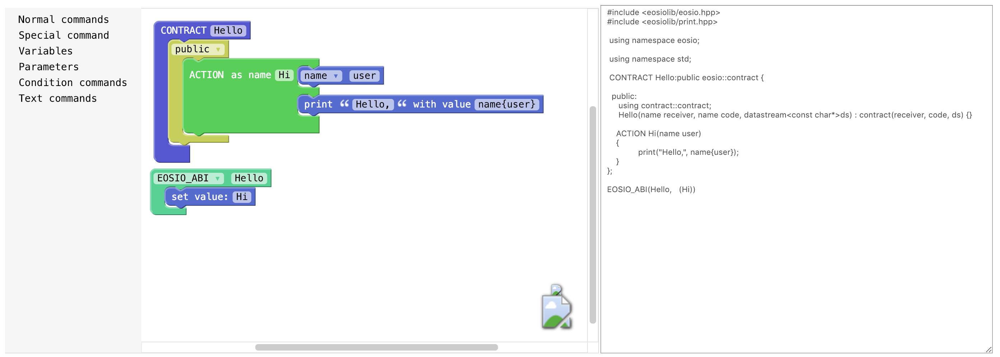

### Welcome to Visual editor fo smart contract (VESM)

VESM is a **web-based visual programming editor for Smart contract**.

VESM is based on [Google Blockly API](https://developers.google.com/blockly/), which is a well known visual code generator. 

### Features

* Programming Smart Contract with visually drag and drop code blocks
* Generate fully compatible Smart Contract source code based on EOSIO 

### Demo
  

### License

 * Licensed under the Apache License, Version 2.0 (the "License");
 * you may not use this file except in compliance with the License.
 * You may obtain a copy of the License at http://www.apache.org/licenses/LICENSE-2.0
